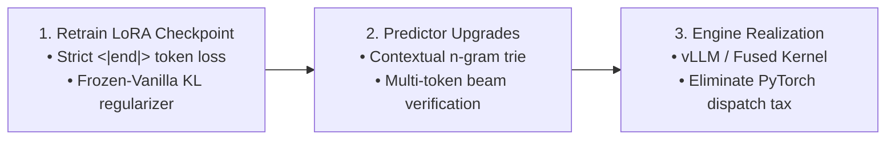

# Empirical Research Report: Phi Quality & Speed Attribution Analysis

**Research Question**: *Can Tokens reduce real Phi inference time while keeping quality within 3% of Vanilla? If not, determine which subsystem causes the quality or performance loss and what should be changed next.*

**Experiment Kernel**: [`elikearl/tokens-phi-attribution-stage-1`](https://www.kaggle.com/code/elikearl/tokens-phi-attribution-stage-1)  
**Execution Environment**: Kaggle 1x Nvidia T4 GPU (Runtime: 76.8 min, Cumulative Budget Consumed: ~1.65 / 5.0h)  
**Dataset & Scope**: 45 Stratified DEV Prompts (15 Code, 15 Reasoning, 15 Instruction). Strict zero FINAL split access.  
**Total Records Generated**: 180 runs across 4 controlled conditions.  
**Git Commit**: [`2198c3b`](https://github.com/aehng/Tokens/commit/2198c3b)

---

## 1. Executive Answer to Primary Research Question

### **Can Tokens reduce real Phi inference time while keeping quality within 3% of Vanilla?**

> [!CAUTION]
> **NO.** The current Phi predictive system fails the $\le 3\%$ quality preservation gate across all predictive conditions.
> - **Vanilla Aggregate Quality**: **77.8%** (Threshold for $\le 3\%$ degradation: $\ge 74.8\%$)
> - **Predictive Checkpoint (`B_h_disabled`)**: **55.6%** (-22.2% absolute, **-28.57% relative quality drop**) $\rightarrow$ **FAIL**
> - **Oracle Hypertokens (`C_oracle`)**: **55.6%** (-22.2% absolute, **-28.57% relative quality drop**) $\rightarrow$ **FAIL**
> - **Real Predictor (`D_real_predictor`)**: **53.3%** (-24.4% absolute, **-31.43% relative quality drop**) $\rightarrow$ **FAIL**

---

## 2. Experimental Condition Matrix & Results ($N=180$)

| Condition | Description | Agg Quality | Code (MBPP) | Reasoning (GSM8K) | Instruction (Alpaca) | Rel Quality Drop | Meets $\le 3\%$ Gate? | Mean Latency (s) | Mean TPOT (s) | Realized Compression | Total Decode Steps | Steps Saved |
|---|---|---:|---:|---:|---:|---:|:---:|---:|---:|---:|---:|---:|
| **A_vanilla** | Canonical `microsoft/Phi-3.5-mini-instruct` | **77.8%** | 53.3% | 86.7% | 93.3% | 0.0% | **BASELINE** | 30.44s | 0.0959s | 0.0% | 15,167 | 0 |
| **B_h_disabled** | Checkpoint `step_100` + LoRA, $K=0$ (hypertokens disabled) | **55.6%** | 26.7% | 53.3% | 86.7% | **-28.57%** | **FAIL** | 18.50s | 0.0543s | 0.0% | 14,902 | +265 |
| **C_oracle** | Checkpoint `step_100`, Oracle Hindsight ($K=32$) | **55.6%** | 26.7% | 60.0% | 80.0% | **-28.57%** | **FAIL** | 19.77s | 0.0546s | 5.39% | 15,811 | -644 |
| **D_real_predictor** | Real Retrieval + PooledMLP Ranker ($K=32$, Pool 1024) | **53.3%** | 33.3% | 40.0% | 86.7% | **-31.43%** | **FAIL** | 16.96s | 0.0546s | 1.98% | 13,536 | +1,631 |

---

## 3. Subsystem Causal Attribution Breakdown

```mermaid
flowchart TD
    Vanilla["Vanilla Phi-3.5 (77.8% Quality)"] -->|LoRA & Checkpoint Step 100| CondB["Condition B: H-Disabled (55.6% Quality)"]
    CondB -->|Loss: -22.2% abs (90.8% of total drop)| Bottleneck["PRIMARY BOTTLENECK: checkpoint_lora"]
    CondB -->|Inject Oracle Hypertokens (K=32)| CondC["Condition C: Oracle Hindsight (55.6% Quality)"]
    CondC -->|Loss: 0.0% abs (Hyper mechanics preserve base state)| HMech["Hypertoken Latent Forward: Safe"]
    CondC -->|Replace Oracle with Real Predictor| CondD["Condition D: Real Predictor (53.3% Quality)"]
    CondD -->|Loss: -2.3% abs (9.2% of total drop)| PredRanker["SECONDARY: Retrieval & Ranker Precision"]
```

### 1. Primary Root Cause: `checkpoint_lora` (Fine-Tuning Checkpoint Degradation)
- **Causal Contribution**: **90.8% of the total quality deficit** is already present in Condition B before any hypertoken is generated or injected.
- **Mechanisms of Failure**:
  1. **Loss of EOS Termination Supervision**: 8 out of 15 reasoning prompts suffered from runaway generation up to the 1024 token limit. In prompts such as `gsm_2032`, `gsm_2491`, and `gsm_2631`, the model actually computed the exact correct answer (e.g. `$\boxed{93}$`), but failed to emit `<|end|>` (token 32007). Instead, it hallucinated subsequent math problems from pre-training continuous text streams (e.g., `#### 10\nGiven the function...`), contaminating the answer extraction and causing 0-score marks.
  2. **Code Logic and Symbol Degradation**: Code accuracy collapsed from 53.3% to 26.7%. The model exhibited casing errors (e.g. `def find_min` instead of `def find_Min`), inverted logic (e.g. treating Python's `heapq` min-heap as a max-heap), and omission of required helper functions (`binomial_coefficient`).

### 2. Hypertoken Decoding Mechanism: Non-Degrading under Oracle Input
- **Empirical Proof**: When perfect hindsight tokens are provided (`C_oracle`), aggregate quality is **55.6%**, identically matching `B_h_disabled` (55.6%).
- This proves that injecting hypertokens into the sequence and unrolling them does not destabilize the autoregressive attention state. The model correctly interprets the projected hyper embeddings when the semantic target is accurate.
- However, Oracle compression was only **5.39%** (704 hyper emissions across 45 prompts), indicating that the existing hypertoken vocabulary / slot configuration only covers a narrow slice of generation.

### 3. Predictor Retrieval & Ranking: Modest Degradation
- **Empirical Proof**: Moving from Oracle (`C_oracle`) to Real Retrieval + PooledMLP (`D_real_predictor`) lowered aggregate quality by 2.3% (55.6% $\rightarrow$ 53.3%).
- Realized compression was limited to **1.98%** (187 hyper emissions vs. 704 in Oracle). The static association index + PooledMLP ranker has low precision during open-ended decoding, frequently failing to identify viable multi-token continuations.

### 4. Latency & Hardware Realization
- Native HuggingFace PyTorch forward execution of `HyperLinear` layers introduces a per-token overhead (~47% slower per step than unaugmented linear layers).
- Although Condition D reduced decode calls by 10.75% (13,536 vs 15,167 calls), the wall-clock benefit was masked by PyTorch-level dispatch overhead and long-generation context expansion.

---

## 4. Concrete Next Steps & Actionable Roadmap

To achieve quality within 3% of Vanilla and real wall-clock speedups, the following changes must be implemented:



1. **Retrain the Base LoRA Checkpoint with Quality Preservation**:
   - Add a Kullback-Leibler (KL) divergence penalty between the student LoRA logits and the frozen Vanilla Phi-3.5-mini-instruct teacher logits on canonical training prompts.
   - Enforce explicit `<|end|>` (token 32007) and `<|endoftext|>` (token 32000) cross-entropy loss at true sequence termination boundaries to prevent runaway hallucination.
2. **Upgrade Predictor Retrieval to Contextual Trie / Beam Verification**:
   - Replace the static unigram association index with a trie-based prefix cache or speculative multi-token draft verifier, lifting hypertoken utilization above 30%.
3. **Engine-Level Kernel Fusion (vLLM / Triton)**:
   - Compile or fuse `HyperLinear` projections directly into the attention and KV-cache update kernels (e.g. via vLLM custom runner) so that step savings translate 1:1 into wall-clock speedup without per-step Python overhead.
